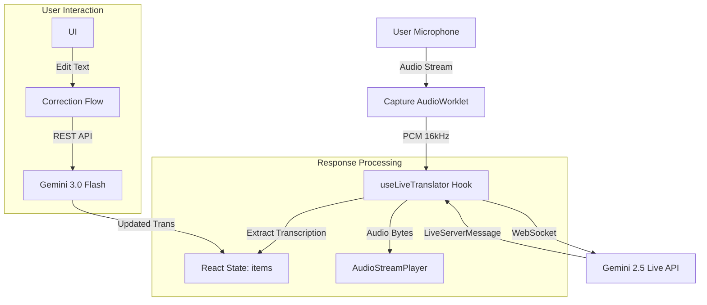

# FlexTranslator Blueprint (v1.4.0)
# Application Blueprint: Flex Translator

Flex Translator is built on a high-concurrency event-driven architecture designed to minimize latency in audio processing and translation delivery.

## 1. System Architecture

## 2. Core Modules
*   **Live Session (WebSocket)**: Managed in `useLiveTranslator.ts`. Handles the full-duplex connection to Gemini.
*   **Audio Pipeline**: 
    *   `Capture AudioWorklet`: Captures audio on a dedicated render thread to prevent UI jank.
    *   `AudioRecorder.ts`: Manages the lifecycle of the Worklet and downsamples to 16kHz.
    *   `AudioStreamPlayer.ts`: Manages a buffer queue for gapless interpretation playback.
*   **Contextual Engine**: `promptUtils.ts` generates specialized system instructions based on the selected "Tone" (Legal, Medical, etc.).
*   **UI/UX Layer**: Dark-mode Tailwind CSS v4 interface optimized for low-friction mobile use.

## 3. Current Limitations & Technical Debt
*   **Volatile Memory**: The `TranslationLogItem` array exists only in RAM. A crash or refresh wipes the session. *Fix: Implement Firestore/LocalStorage sync.*
*   **API Key Exposure**: The key is currently read from environment variables on the client side. *Fix: Implement backend proxy via Firebase Functions.*
*   **CSS Chunking**: Main bundle exceeds 500kB. *Fix: Implement dynamic imports for heavy components like PDF generation.*

## 4. Branding Guidelines
*   **Primary Accent**: Rose-500 (`#f43f5e`)
*   **Surface Colors**: Slate-900 / Slate-800
*   **Typography**: Inter (Global), Noto Nastaliq Urdu (RTL Specific)